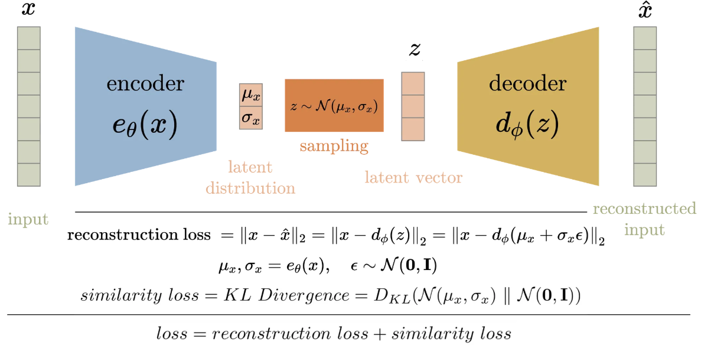

# Variational AutoEncoder for Dog Images

<p align="center">
  
</p>

## Project Overview
The project consists of building a Variational AutoEncoder (VAE) architecture to learn features from dog images and be able to reconstruct them.

## Dataset:

The data consists of dog images stored in the train and test folders. There is also a .csv file that associates the image name with the dog's breed.
These data can be obtained via Kaggle: [Dog Breed Indetification](https://www.kaggle.com/c/dog-breed-identification/data).

## Contents:

The repository contains the following files:
- `vae_model.py` -> Constructs the encoder-decoder architecture used, along with auxiliary.
- `tasks.py` - > Answers questions regarding breed mixture and identification.
- `requirements.txt` -> Lists the dependencies.
- Additionally, the `images` folder contains images used during task execution.

## Usage:

### To run the code and replicate the outputs, simply execute:
```sh
python vae_model.py
```
## Steps to Execute the Code and Replicate the Results

1. Clone this repository to your computer using the terminal command:
```
git clone https://github.com/MatheussAlvess/Variational_AutoEncoder.git
```
2. Navigate to the project directory.
3. Ensure you have the necessary dependencies installed by running:
```
 pip install -r requirements.txt
```
5. Extract the dataset folder and rename it to `data` (this folder must contain the `_train_` subfolder).
6. Run the following command in the terminal:
   `python vae_model.py`
   
#### What Does This Command Do?

- It executes the `vae_model.py` code.
- The script loads the data, trains the VAE model, and saves the encoder and decoder models.
- The models are saved in the current directory using the default parameters defined in the `build_model` function.

#### Notes:
- You can modify the VAE model parameters by editing the `vae_model.py` script, either by passing parameters to `build_model` or adjusting hyperparameters internally (such as filter sizes, number of layers, etc.).
- This is the first version of the project, meaning there is still room for many improvements. This includes optimizing hyperparameters and refining the encoder-decoder architecture.
- The architecture is based on [ _code examples_](https://keras.io/examples/generative/vae/) that use the MNIST dataset, providing a validated starting point for achieving efficient results quickly.
- The results were acceptable, given that no optimization was performed. To improve performance, consider increasing the number of epochs, analyzing loss metrics, modifying the encoder and decoder structures, and adjusting other parameters.

#### Next Steps:
- Perform clustering in the latent space based on dog breeds. The goal is to evaluate the breed of a given input image.

> [!NOTE]
> - Due to the size of the saved models, they could not be uploaded to the repository. To replicate the results, simply run the script with the default parameters.
> - This project is part of a technical case evaluated for a Data Scientist position at HandTalk. Therefore, it is common to find comments in the code written in Portuguese.
